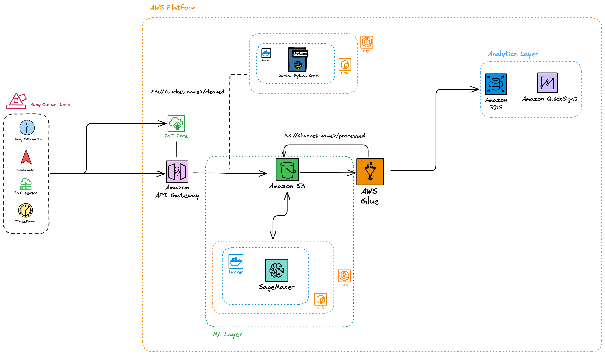

# 50.046 Cloud Computing & IoT - Final Project

## Project Description

The main goal of this project is to create a system which consists of both an analytical system as well as an infrastructure system for oiler companies to detect early oil spills along crucial tanker routes to prevent large cleanups expenditure as well as protect marine ecosystem from the long exposure of these harmful chemicals.

The main features of this project include:

- Detect if oil exists on the surface of the water body utilising an ESP32 on a buoy system.
- Collection of the data from the buoy stored in the cloud for logging and analysis
- Display and analysis of the data to encourage efficient cleanup and tagging of the location where the oil spill occurred.

To execute this project we have come up with the following solution:

## System Architecture Diagram



## Proof-of-Concept

## Architectural Overview

### Cloud Infrastructure (AWS)

- **API Gateway**: Entrypoint for data ingestion from ESP32 via LoRA
- **Lambda**: Serveless function processing sensor data
- **S3**: Object storage for raw sensor data
- **RDS PostgreSQL**: Central database for analytics & machine learning
- **ECS Fargate**: Container orchestration for frontend & backend processing
- **Application Load Balancer (ALB)**: HTTPS/HTTP load balancer for backend processing
- **ECR**: Container registry for Docker images
- **Secrets Manager**: Secure credential storage
- **Virtual Private Cloud (VPC)**: Private network for central database and containers.

### Microservices

1. Python Backend Processing Service (Port 8080)

- REST API for processing S3 object raw data
- Health checks and sensor readings endpoint

| Description     | Paths              |
| :-------------- | :----------------- |
| Health          | `/health`          |
| DB Connection   | `/db-health`       |
| Sensor Readings | `/readings-latest` |

2. Lambda Function

- Process ESP32 sensor JSON data
- Triggered by API Gateway

## Quick Start

For detailed instructions, check out [QUICKSTART.md](./QUICK-START.md)

### Prerequisites

- AWS CLI v2
- Terraform > = 1.0
- Docker
- Make
- Node.js
- AWS account with appropriate permissions

> [!NOTE]
>
> You can always check by running these commands:
>
> - `aws --version`
> - `tofu version` or `terraform version`
> - `make --version` (usually installed on macOS/Linux)
> - `docker --version`
> - `node --version`
> - `aws configure list`
>
> or you can run this script and it will conduct the check for you:
>
> ```zsh
> make prereq
> ```

## Production Deployment

### Step 1: Create RDS Credentials

> [!IMPORTANT]
> Do this FIRST before running OpenTofu or Terraform!

```zsh
aws secretsmanager create-secret \
    --name rds_credentials \
    --secret-string '{"username": "<your_username>", "password": "<your_secure_password>"}'
```

or run this command if you have `make`:

```zsh
cd infra
make setup-secrets
```

### Step 2: Deploy Infrastructure

```zsh
cd infra
terraform init
terraform plan
terraform apply
```

or alternatively, if you are using `opentofu`

```zsh
cd infra
make init
make validate
make plan
make pre-deployment   # only apply if all checks passed!
make apply
```

**Deployment time**: 10~15 minutes (due to RDS initialization & startup)

**What gets created**:

**Storage & Data:**

- S3 bucket with 3 folders: `raw/`, `cleaned/` & `processed/`
- RDS PostgreSQL instance (db.t3.micro) in private subnets
- DB Subnet Group for RDS

**Networking:**

- VPC with public/private subnets across 2 AZs
- Internet Gateway for public subnets
- Route Tables (public and private) with associations
- Security Groups:
  - ALB Security Group (HTTP from Internet)
  - ECS Tasks Security Group (HTTP from ALB)
  - RDS Security Group (PostgreSQL from VPC/ECS)

**Container Infrastructure:**

- ECR Repositories (backend and frontend) with lifecycle policies
- ECS Cluster with Container Insights enabled
- ECS Task Definitions (backend and frontend)
- ECS Services (backend and frontend) running on Fargate

**Load Balancing:**

- Application Load Balancer (HTTP only - HTTPS commented out)
- Target Groups (backend and frontend) with health checks
- ALB Listener with path-based routing rules

**Serverless:**

- Lambda function for data ingestion
- API Gateway (HTTP API v2) with routes
- Lambda permission for API Gateway invocation

**Monitoring & Logging:**

- CloudWatch Log Groups for backend and frontend ECS tasks

**IAM:**

- Lambda execution role with S3 and CloudWatch permissions
- ECS Task Execution role (pulls images, writes logs, accesses secrets)
- ECS Task role (application permissions for S3 and Secrets Manager)

### Step 3: Deploy Backend & Frontend Services

```zsh
cd infra

# Deploy both service
make deploy-all

# Or deploy individually
make push-backend
make push-frontend
```

**Deployment time**: 3-5 minutes per service

**What happens**:

1. Builds Docker image via Dockerfiles
2. Pushes to ECR with multiple tags (`:latest`, `:timestamp`, `git-sha`)
3. Registers new ECS task definition (forces fresh image pull)
4. Updates ECS service
5. Waits for health checks
6. Drains old tasks

### Step 4: Verify Deployment

```zsh
# Check service status
make status

# Health check
make output-summary
# Expected: key outputs showing ALB URL

# Or manually
terraform output alb_dns_name
curl https://{alb_dns_name}/health
# Expected: {"status":"ok"}
```

Step 5: Test Your APIs

```zsh
# Get service URLs
cd infra
terraform output alb_dns_name
terraform output backend_api_url
terraform output frontend_url

# Test endpoints
curl http://${alb_dns_name}/health
curl http://${alb_dns_name}/db-health
curl http://${alb_dns_name}/readings-latest?limit={5}
curl http://${backend_api_url}/health
curl https://${frontend_url}
```

## Production URLs

After deployment, services will be available at:

**Web App**: `http://ciot-backend-alb-dev-xxx.ap-southeast-1.elb.amazonaws.com`

## Backend Development & Deployment

### Making Code Changes

```zsh
# 1. Edit your code
vim backend/app.py

# 2. Test locally (optional)
cd backend
docker build -f dockerfile -t "$ECR_REPO_URL:latest"

# 3. Deploy to AWS
make push-backend

# 4. Monitor deployment
make watch-backend

# 5. Check logs
make logs-backend

# 6. Verify
curl http://${backend_api_url}/health
```

### Common Backend Commands

```zsh
cd backend
```

> [!NOTE]
>
> The following commands are used together with prefix `make`

|     Commands      | Description                        |
| :---------------: | :--------------------------------- |
|      `help`       | View all commands                  |
|   `deploy-all`    | Deploy all services                |
|  `push-backend`   | Deploy Python backend service only |
|  `push-frontend`  | Deploy frontend service only       |
|     `status`      | Status of all services             |
| `status-backend`  | Backend service status             |
| `status-frontend` | Frontend service status            |
|   `status-all`    | Backend & Frontend service status  |
|  `health-check`   | Test endpoints                     |
|  `logs-backend`   | Stream backend logs                |
|  `logs-frontend`  | Stream frontend logs               |
|   `list-images`   | Recent ECR images                  |

## Infrastructure Management

### Common Terraform Commands

```zsh
cd infra
```

> [!NOTE]
>
> The following commands are used together with prefix `make`

|     Commands     | Description                 |
| :--------------: | :-------------------------- |
|      `help`      | View all commands           |
|      `init`      | Initialize Terraform        |
|      `plan`      | Preview changes             |
|     `apply`      | Deploy infrastructure       |
|    `destroy`     | Destroy infrastructure      |
|     `output`     | Show outputs                |
| `output-summary` | Show key outputs            |
|     `status`     | Check infrastructure status |
|  `check-health`  | Check infrastrcuture status |
|  `logs-lambda`   | View lambda logs            |

### Infrastructure Updates

To update infrastructure:

```zsh
cd infra

# 1. Make changes to .tf files
vim alb.tf

# 2. Preview changes
make plan

# 3. Apply changes
make apply
```

## Monitoring & Troubleshooting

### View Logs

```zsh
# Backend services
cd backend
make logs-backend
make logs-frontend

# Lambda function
cd infra
make logs-lambda

# Or directly with AWS CLI
aws logs tail /ecs/ciot-backend-dev --follow --region ap-southeast-1
aws logs tail /ecs/ciot-frontend-dev --follow --region ap-southeast-1
```

### Check Service Health

```zsh
cd backend
make health-check

# Or manually
curl http://${alb_dns_name}/health
curl http://${backend_api_url}/health
curl http://${frontend_url}
```

### Common Issues

#### Service Not Starting

```zsh
cd backend
make logs-backend

# Check ECS events
aws ecs describe-services \
  --cluster ciot-cluster-dev \
  --services ciot-backend-service-dev \
  --region ap-southeast-1 \
  --query 'services[0].events[:10]' \
  --output table

aws ecs describe-services \
  --cluster ciot-cluster-dev \
  --services ciot-frontend-service-dev \
  --region ap-southeast-1 \
  --query 'services[0].events[:10]' \
  --output table
```

#### Health Check Failing

1. Wait 3-5 minutes for deployment
2. Check ALB target group health
3. Monitor unhealthy logs in ECS

## Security Best Practices

1. **Never commit secrets to Git**

- Use AWS Secrets Manager
- Add to `.env` to `.gitignore` if testing locally

2. **Use strong passwords**

- Generate secure passwords for RDS credentials
- Rotate regularly

3. **Enable HTTPS**

- Configure your custom domain (if possible)
- HTTP automatically redirects to HTTPS

4. **Review Security Groups**

- Minimal ingress rules
- VPC isolation for RDS and ECS tasks

5. **Use IAM roles, not access keys**

- Already configured in infrastructure
- No hardcoded credentials

## Project Structure

```zsh
ciot-oil-detection-project/
├── backend/
│   ├── app.py                     # Python backend API
│   ├── db_setup.py                # PostgreSQL database schema setup
│   ├── docker-compose.yml         # Local development
│   ├── dockerfile                 # Dockerfile for ECS
│   ├── requirements.txt           # Python dependencies
│   └── Makefile                   # Deployment commands
├── frontend/
│   ├── node_modules
│   ├── public
│   ├── src                        # React App files
│   └── dockerfile                 # Dockerfile for ECS
├── infra/
│   ├── *.tf/                      # Terraform configuration
│   ├── Makefile                   # Infrastructure commands
│   └── INFR.md                    # Infrastructure detailed docs
├── QUICK-START.md               # Detailed quick start
├── README.md                    # This file
└── LICENSE
```

## Documentation

- [QUICK-START.md](./QUICK-START.md)
- [infra/INFR.md](./infra/INFRA.md)

## Key Configuration

|        **Component**        |            **Value**             |
| :-------------------------: | :------------------------------: |
|       **AWS Region**        |   `ap-southeast-1` (Singapore)   |
|       **ECS Cluster**       |        `ciot-cluster-dev`        |
| **Backend ECR Repository**  |        `ciot-backend-dev`        |
| **Frontend ECR Repository** |       `ciot-frontend-dev`        |
|        **Database**         |       `postgresql` on RDS        |
|        **Services**         |      `backend`, `frontend`       |
|      **Load Balancer**      |      `ciot-backend-alb-dev`      |
|         **Domain**          | Configurable in terraform.tfvars |

## Team Workflow

### Daily Development

Check out [Backend Development & Deployment](#backend-development--deployment) for more details on backend improvements and development!

Checkout [Infrastructure Management](#infrastructure-management) for more details on infrastructure developments!

## Contributing

1. Create feature branch
2. Make changes
3. Test locally with Docker Compose
4. Deploy to AWS and Verify
5. Create pull request

## Acknowledgements

**Project**: 50.046 Cloud Computing & IoT Final Project  
**System**: Oil Detection System  
**Last Updated**: December 2025

> [!TIP]
>
> - Keep [QUICK-START.md](./QUICK-START.md) open while working
> - Use `make help` to see available commands
> - Monitor deployments with `make status-backend/frontend`
> - Always run `make health-check` after deploying

**For a detailed quick startup instruction, see [QUICK-START.md](./QUICK-START.md)**

---

This project is an undertaking of the [50.046 - Cloud Computing & IoT](https://www.sutd.edu.sg/course/50-046-cloud-computing-and-internet-of-things/) module during Fall 2025 under the **Information Systems Technology & Design (ISTD)** faculty the **Singapore University of Technology & Design (SUTD)**.

**Contributors**:  
Copyright &copy; Vancence &nbsp;|&nbsp; CSD &nbsp;|&nbsp; SUTD  
Copyright &copy; Andrew &nbsp;|&nbsp; CSD &nbsp;|&nbsp; SUTD  
Copyright &copy; Joshua &nbsp;|&nbsp; CSD &nbsp;|&nbsp; SUTD  
Copyright &copy; Ammar &nbsp;|&nbsp; CSD &nbsp;|&nbsp; SUTD

<a href="https://github.com/vancenceho/ciot-oil-detection-project/graphs/contributors">
  
</a>
